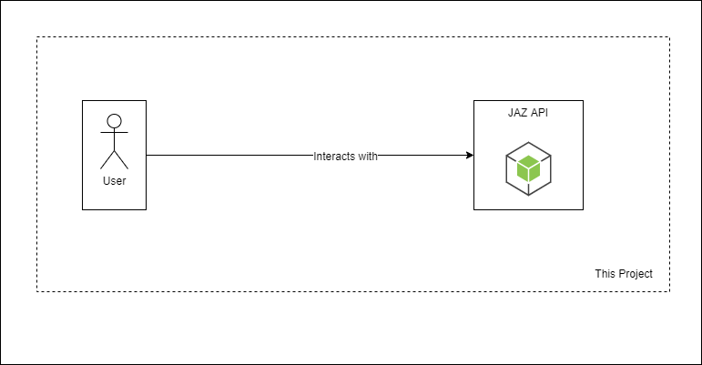

# Penjar - PostgreSQL Express Node Jest Axios React

Penjar is the fastest way to spin up a Full Stack application (React + Node) with Jest testing. Evolution and based off of the [Careen](https://github.com/NguyenAndrew/careen) stack. Now using TypeScript!

## Architecture



## QuickStart - Running Locally
1. Navigate to the run_locally directory
2. Open terminal of choice in the run_locally directory
3. Install your dependencies with ```npm install```
5. Run your application with ```npm run start``` (Note: `start:windows`, `start:linux`, and `start:mac` are also available)
6. Ready to Code!

## QuickStart - Running on Docker
1. Make sure you are on the root directory
2. Build the docker image: `docker build -t my-penjar-app-image .`
3. Run the image as a docker container: `docker run -p 8080:8080 -it --rm --name my-running-penjar-app-container my-penjar-app-image`

## Quickstart - Editting Diagrams
1. Download [Draw.io Desktop Edition](https://github.com/jgraph/drawio-desktop/releases)
2. In diagrams folder, open architecture.drawio.png in Draw.io Desktop Edition
3. Make changes
4. Click save button!

## Quickstart - Upgrading (Updating) all dependencies
1. Note: This command will update dependencies in the following folders: run_locally, back_end, and front_end
2. Navigate to the run_locally directory
3. Open terminal of choice in the run_locally directory
4. Check which dependencies need to be upgraded with ```npm run dependup:check```
5. Upgrade all dependencies with ```npm run dependup```
6. Upgrade dependencies in your package-lock.json with ```npm install```
7. Optional: Check to see which dependencies were not updated (due to failing tests) with ```npm run dependup:check```

## Quickstart - (Optional) Configuring a database
1. Navigate to the back_end directory
2. For local setup: Create a database.json file in the **src/database** directory, configure this information with database credentials (Note: database.json in back_end directory is excluded by git in .gitignore).
3. For cloud setup: Place database credentials within env variables, parse this information by inserting custom code into databaseInfo.ts
4. Configure database client

## Roadmap
* Add rest of tests for existing code on the back end